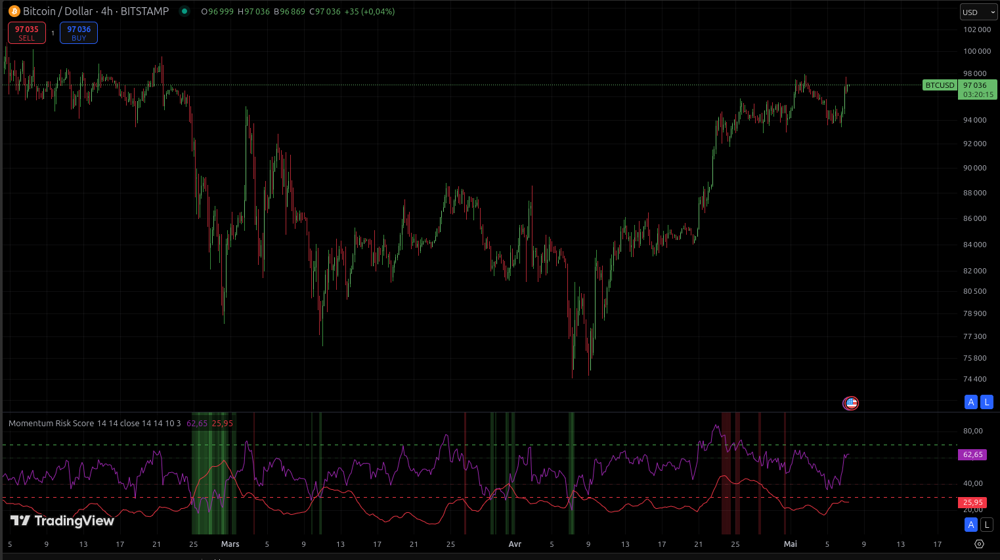

# Indicateur personnalisé : Momentum Risk Score

> ⚠️ Avant toute chose, il est important de noter qu’**aucun indicateur n’est infaillible**. Il doit toujours être utilisé en complément de votre propre analyse technique et contextuelle.

---

## Présentation de l'indicateur

L’**indicateur Momentum Risk Score** a été développé par moi-même en collaboration avec un autre membre de mon serveur Discord.  
Il a été conçu et **testé exclusivement sur les cryptomonnaies**.

L’objectif principal de cet indicateur est de **fournir des zones d’entrée et de sortie progressives** sur un actif. Il ne s’agit pas de détecter un point unique d’achat ou de vente, mais plutôt d’accompagner une gestion en plusieurs paliers.

---

## Sur quoi repose-t-il ?

Le score généré par l’indicateur est calculé à partir de plusieurs outils techniques reconnus :

- **RSI (Relative Strength Index)**
- **ADX (Average Directional Index)**
- **Choppiness Index**
- **DI+ et DI-**
- **Supertrend**

Ces éléments sont combinés afin de générer un score de risque qui vous guide visuellement dans votre prise de décision.

---

## Recommandations d'utilisation

Les meilleures performances d’analyse ont été observées sur des unités de temps en :

- **4 heures (H4)**
- **Journalier (1D)**

---

## Comment lire l’indicateur ?

- Il apparaît **dans le panneau inférieur** de votre graphique TradingView.
- Il est **borné entre 0 et 100**.
- Deux courbes sont affichées :
  - **Violet** : le RSI
  - **Rouge** : l’ADX

- Des **barres verticales colorées** complètent l’analyse :
  - Les **nuances de vert** indiquent des **zones d’achat potentielles**. Plus le vert est intense, plus le signal est favorable.
  - Les **nuances de rouge** signalent des **zones de vente potentielles**. Plus la teinte est forte, plus le risque de retournement est élevé.

---

## Aperçu visuel

---

Utilisez cet indicateur comme un **outil d’aide à la décision**, jamais comme une certitude. Combinez toujours plusieurs sources d’information avant de prendre position.

---