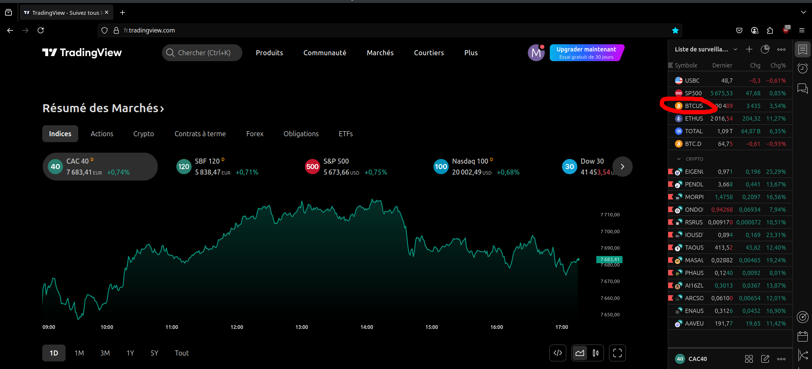
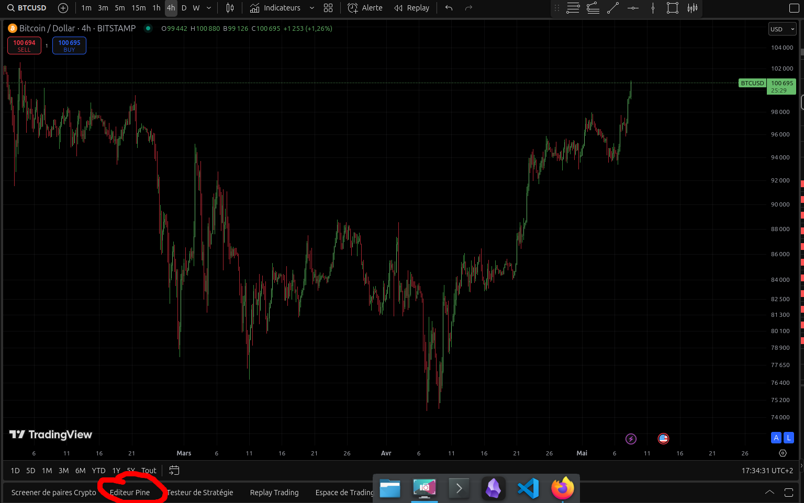
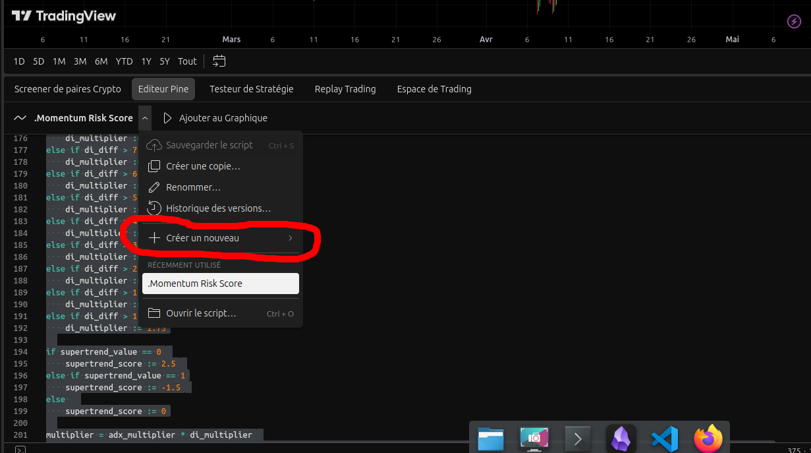

# Importer un indicateur personnalisé dans TradingView

Cette documentation vous guide pas à pas pour importer un code d'indicateur dans TradingView.

---

## 1. Créer un compte sur TradingView

Rendez-vous sur [https://fr.tradingview.com/](https://fr.tradingview.com/) et créez un compte si vous n'en avez pas déjà un.

---

## 2. Accéder à l'actif souhaité

Sur la plateforme, vous pouvez enregistrer des actifs financiers qui vous intéressent.  
Dans notre cas, nous allons utiliser **le Bitcoin (BTC/USD)**.  
Accédez à la page suivante :  
👉 [https://fr.tradingview.com/symbols/BTCUSD/](https://fr.tradingview.com/symbols/BTCUSD/)

---

## 3. Ouvrir le graphique

Cliquez sur **"Graphique"** pour afficher le graphique interactif de l'actif.

---

## 4. Accéder à l'Éditeur Pine

En bas de l'écran, cliquez sur l'onglet **"Éditeur Pine"**.

---

## 5. Créer un nouvel indicateur

Dans l'Éditeur Pine :
- Cliquez sur **"Créer un nouveau"**
- Choisissez **"Indicateur"**

Collez ici le code de votre indicateur personnalisé.

---

Et voilà, vous avez importé un indicateur dans TradingView ! 🎉